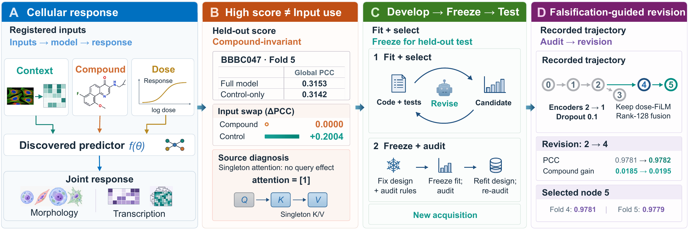

<a id="top"></a>

<div align="center">

<h1>CellAudit</h1>
<h3>Discover, Falsify, Revise</h3>

<p><b>Auditing Input-Use Claims from Source Code to Predictive Contribution in Agent-Discovered Cell Models</b></p>

<p>Mengran Li · Bo Li · Chengyang Zhang · Yang Yan · Jinfeng Xu · Zhenchao Tang</p>

<p><b>Separate predictive performance, source-level input paths, fitted-model dependence, and target-relevant contribution.</b></p>

<p>
  <a href="https://limengran98.github.io/CellAudit"></a>
  <a href="https://limengran98.github.io/CellAudit/assets/CellAudit.pdf"></a>
  <a href="docs/REPRODUCIBILITY.md"></a>
</p>

<p>
  <a href="pyproject.toml"></a>
  <a href="LICENSE"></a>
  <a href="tests"></a>
</p>

<p>
  <a href="#quick-start"><b>Quick start</b></a> ·
  <a href="#workflow"><b>Workflow</b></a> ·
  <a href="#data"><b>Data</b></a> ·
  <a href="#discovery"><b>Discovery</b></a> ·
  <a href="#audit"><b>Audit</b></a> ·
  <a href="#outputs"><b>Outputs</b></a> ·
  <a href="#extend"><b>Extend</b></a> ·
  <a href="#project-page"><b>Website source</b></a> ·
  <a href="#citation"><b>Citation</b></a>
</p>

</div>

CellAudit is an executable toolkit for language-model-guided discovery and
deterministic post-selection testing of cellular perturbation-response models.
The prediction-score setting uses the existing CellScientist discovery policy
to propose task-specific PyTorch predictors. CellAudit supplies the fixed
execution harness, source checking, and input-use audit. After selection, it
freezes the model source and independently asks three questions:

1. Does the cited computation consume the stated input without a recognized
   algebraic contradiction?
2. Do matched input replacements change the complete fitted model's
   predictions?
3. Does that dependence improve prediction of the observed response?

These are different properties. An executable input route does not guarantee
that training makes use of it, and input sensitivity does not by itself imply
predictive benefit.

<p align="center">
  <a href="https://limengran98.github.io/CellAudit">
    
  </a>
</p>

Explore the [project page](https://limengran98.github.io/CellAudit)
for the paper's figures and results, or read the
[method contract](docs/METHOD_CONTRACT.md) and
[reproduction guide](docs/REPRODUCIBILITY.md) to work through the implementation.

<a id="quick-start"></a>

## Quick start

CellAudit requires Python 3.10 or later. Install it in an isolated environment:

```bash
cd CellAudit
python -m venv .venv
source .venv/bin/activate
python -m pip install -e .
```

Validate the installation and run the CPU regression suite:

```bash
cellaudit validate
python -m unittest discover -s tests -v
```

`validate` reports the registered tasks, expected input files, starting-model
hash, and fold roles. Missing data are reported as unavailable rather than
silently replaced.

<a id="workflow"></a>

## Workflow

```text
Folds 1--2                  Fold 3                  Fold 4                 Fold 5
fit candidates  ->  discovery and selection  ->  held-out input test  ->  replication
       |                       |                        |                       |
       +------------- fixed task contract and evaluator ---------------------+
```

CellAudit provides three controlled discovery settings and one shared audit:

| Setting | Question | CLI identifier |
| :--- | :--- | :--- |
| **Prediction-score discovery** | What model is selected from predictive feedback? | `open` |
| **Path-constrained discovery** | Does deterministic compilation produce a valid perturbation route? | `source-constrained` |
| **Falsification-guided discovery** | Can a perturbation increment add predictive value beyond a fixed context anchor? | `falsification-guided` |
| **Held-out input-use audit** | What inputs does the frozen fitted model actually use, and do they help prediction? | `audit` |

The three discovery settings are comparisons under the same task boundary;
they are not sequential stages that every model must traverse.

### What is fixed

The executor owns data loading, preprocessing, folds, targets, evaluator,
checkpoint selection, training limits, repair budget, and resource accounting.
Candidate code may change only registered model and optimization components.
Persistent failures consume candidate slots. Every accepted model is bound to
its source, configuration, checkpoint, metrics, parent, proposal, and hashes.

### What is deterministic after selection

The source checker, intervention-map construction, prediction comparisons,
target-loss contrasts, status rules, and Fold-5 authorization do not call a
language model. Fold 5 opens only after the selected source and Fold-4 summary
have been frozen.

<a id="data"></a>

## Data

The included task registry instantiates paired Cell Painting and L1000 response
prediction for BBBC036 and BBBC047. Place the released replicate-level profiles
at the following paths:

```text
data/
├── BBBC036/
│   ├── CellPainting/replicate_level_cp_normalized_variable_selected.csv.gz
│   └── L1000/replicate_level_l1k.csv.gz
└── BBBC047/
    ├── CellPainting/replicate_level_cp_normalized_variable_selected.csv.gz
    └── L1000/replicate_level_l1k.csv.gz
```

The adapters construct same-plate control profiles, 2,048-bit Morgan compound
features, log dose, paired Cell Painting/L1000 targets, and response-blind
Murcko-scaffold folds. File locations and task semantics are declared in
[`configs/tasks.json`](configs/tasks.json). The underlying paired profiles are
described in the public data release
([doi:10.1038/s41592-022-01667-0](https://doi.org/10.1038/s41592-022-01667-0)).

Supply released profiles at the registered paths; runs write model checkpoints,
evaluation records, and audit outputs to the chosen output directory.

<a id="discovery"></a>

## Configure a language-model provider

Discovery uses an OpenAI-compatible Chat Completions endpoint. Provider
metadata live in [`configs/model_panel.json`](configs/model_panel.json); the
served model can be changed without modifying the discovery or audit logic.

```bash
export CELLAUDIT_DEEPSEEK_BASE_URL="https://your-endpoint.example/v1"
export CELLAUDIT_DEEPSEEK_API_KEY="your-token"
```

Gemini-compatible and local Qwen examples are included in the same model panel.
For machine-local configuration, copy
[`configs/local_endpoints.template.json`](configs/local_endpoints.template.json)
to the ignored `configs/local_endpoints.json`. Credentials remain in environment
variables or a local credential file.

## Run discovery

Start with a smoke trajectory:

```bash
cellaudit discover \
  --stage open \
  --task bbbc036 \
  --mode smoke \
  --seed 2026080701 \
  --device cuda:0 \
  --output-root runs/smoke_bbbc036
```

Run a registered ten-trajectory campaign:

```bash
cellaudit campaign \
  --stage falsification-guided \
  --task bbbc047 \
  --trajectories 10 \
  --seed-base 2026080701 \
  --device cuda:0 \
  --output-root runs/bbbc047_falsification_guided
```

Every trajectory has ten physical candidate slots including the starting
model. The run keeps failed proposals, automatic repairs, resource usage, and
the complete selection history.

<a id="audit"></a>

## Freeze and audit selected models

Prediction-score discovery first ranks every executable candidate from the
complete ten-trajectory campaign using Fold-3 Global PCC, then MSE, parameter
count, and a stable identifier. The selected source is refit under five paired
seeds before the audit:

```bash
cellaudit audit prepare-open-refits \
  --task bbbc047 \
  --discovery-root runs/bbbc047_open_discovery \
  --seed-base 2026080901 \
  --device cuda:0 \
  --output-root runs/bbbc047_open_refits

cellaudit audit freeze \
  --method open \
  --task bbbc047 \
  --discovery-root runs/bbbc047_open_refits \
  --output-root runs/bbbc047_open_audit
```

Path-constrained and falsification-guided campaigns instead carry each frozen
trajectory winner into the audit:

```bash
cellaudit audit freeze \
  --method falsification-guided \
  --task bbbc047 \
  --discovery-root runs/bbbc047_falsification_guided \
  --output-root runs/bbbc047_guided_audit
```

Run Fold 4, authorize the frozen replication boundary, and run Fold 5:

```bash
cellaudit audit run --output-root runs/bbbc047_guided_audit --fold 4 --device cuda:0
cellaudit audit summarize --output-root runs/bbbc047_guided_audit --fold 4
cellaudit audit authorize-fold5 --output-root runs/bbbc047_guided_audit
cellaudit audit run --output-root runs/bbbc047_guided_audit --fold 5 --device cuda:0
cellaudit audit summarize --output-root runs/bbbc047_guided_audit --fold 5
```

The audit records Global PCC, MSE, modality-specific PCC, prediction-space
change, compound and context effects, identifiable dose effects, interaction,
target-loss gain, calibrated status, and hashes binding the model and maps.
Thirty-two matched maps calibrate each fitted model; they are repeated
measurements, not independent training replicates.

<a id="outputs"></a>

## Inspect outputs

```text
runs/<campaign>/
├── campaign_freeze.json
├── campaign_summary.json
├── trajectory_01/
│   └── result/
│       ├── run_manifest.json
│       ├── run_result.json
│       └── ...
└── _SUCCESS

runs/<audit>/
├── ALL_ENDPOINT_REGISTRY.json
├── FOLD4_AUDIT_FREEZE.json
├── FOLD4_AUDIT_SUMMARY.json
├── fold4_units/
├── FOLD5_REPLICATION_FREEZE.json
├── FOLD5_REPLICATION_SUMMARY.json
└── fold5_units/
```

Search records retain hypotheses, source or design cards, repairs, metrics,
checkpoints, token usage, and compute time. Audit records retain selected-model
identity, intervention maps, continuous effects, source-check findings,
behavioral status, and final authorization. See
[`docs/REPRODUCIBILITY.md`](docs/REPRODUCIBILITY.md) for the three supported
reproduction levels and integrity checks.

<a id="extend"></a>

## Extend CellAudit

| Goal | Starting point |
| :--- | :--- |
| Add a cellular-response task | [`configs/tasks.json`](configs/tasks.json), [`cellaudit/tasks.py`](cellaudit/tasks.py) |
| Add or replace an LLM | [`configs/model_panel.json`](configs/model_panel.json), [`cellaudit/provider_client.py`](cellaudit/provider_client.py) |
| Change the candidate language | [`cellaudit/discovery_candidate.py`](cellaudit/discovery_candidate.py) |
| Add a deterministic design compiler | [`cellaudit/discovery/`](cellaudit/discovery/) |
| Add an input-use rule | [`cellaudit/deterministic_claim_checker.py`](cellaudit/deterministic_claim_checker.py) |
| Add a behavioral intervention | [`cellaudit/audit/endpoint_panel.py`](cellaudit/audit/endpoint_panel.py) |

New tasks should register biological input coordinates, legal replacements,
fold roles, target construction, and evaluation units before discovery begins.
New providers should implement the same OpenAI-compatible response contract;
the deterministic audit remains provider-independent.

The Python package and module entry point are both named `cellaudit`:

```bash
python -m cellaudit --help
```

## Repository map

```text
cellaudit/                   discovery, compilation, training, and audit runtime
configs/                     tasks, providers, search settings, and fixed protocol
assets/starting_candidates/  replayable starting model
docs/                        method contract and reproducibility guide
scripts/                     end-to-end command wrappers
tests/                       contract and integration regression tests
project-page/dist/           public project page, figures, and paper PDF
```

<a id="project-page"></a>

## Project page

The [public project page](https://limengran98.github.io/CellAudit)
and this repository link to each other. Its static HTML, styles, scripts, and
paper assets are included in [`project-page/dist/`](project-page/dist/).

To preview the page locally from the repository root:

```bash
python -m http.server 4173 --directory project-page/dist
```

Open [localhost:4173](http://localhost:4173). The page runs as a static site.

<a id="citation"></a>

## Citation

```bibtex
@misc{li2026cellaudit,
  title = {Discover, Falsify, Revise: Auditing Input-Use Claims from Source Code to Predictive Contribution in Agent-Discovered Cell Models},
  author = {Li, Mengran and Li, Bo and Zhang, Chengyang and Yan, Yang and Xu, Jinfeng and Tang, Zhenchao},
  year = {2026},
  url = {https://limengran98.github.io/CellAudit}
}
```

## License

Code is released under the [MIT License](LICENSE). Dataset files retain the
terms of their respective source releases.

---

<p align="center">
  <b>Discover a model. Freeze it. Test what it uses.</b><br>
  <sub><a href="#top">Back to top ↑</a></sub>
</p>
